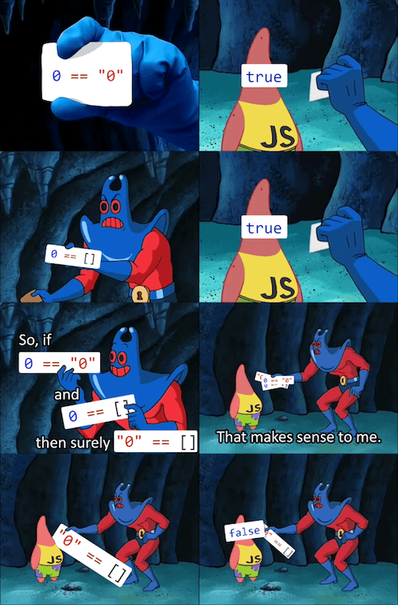

# Hello Node.js


O que é o node?
O Node.js pode ser definido como um ambiente de execução Javascript server-side.
Ou seja com o node usamos JavaScript <3 no server-side(backend)

Já tem o node instalado?
Na linha de comando digite:

`node --version`

Se tiver instalado vai aparecer a versão.
Caso não tenha, esse é o link para instalação: https://nodejs.org/en/download/

# Tipos em JavaSscript

## Tipagem dinâmica
JavaScript é uma linguagem de tipagem dinâmica. Isso significa que você não necessita declarar o tipo de uma variável antes de sua atribuição. O tipo será automaticamente determinado quando o programa for processado. Isso também significa que você pode reatribuir uma mesma variável com um tipo diferente.

## Tipos Primitivos

* Boolean
`false`(0) e `true`(1)

* Null (nulo)
null pode ser utilizado para representar um valor vazio

* Undefined
valor que nao foi definido

* Number
valores numéricos (podem ser inteiros ou decimais 5 ou 5.0)

* BigInt (numero grandao)
o tipo Number é limitado por isso o tipo de dado BigInt foi criado. Com ele é possível representar inteiros de precisão não exata. Para fazer uso dele você pode adicionar um n ao final do número inteiro ou chamar a função BigInt() como mostrado abaixo:
``
90071992547409910n * 100n
9007199254740991000n
``
com o Number:
``
90071992547409910 * 100
9007199254740990000
``

String (representa textos)
```
'hello world'
"hello world"
`hello world`
```


# Operadores

## Operadores Matemáticos

```
+  mais
-  menos
*  multiplicação
/  divisão
%  resto
** potencia
```

## Operadores de Atribuição

a = 2 -> atribui valor de 2 para a


## Operadores de Comparação

```
==   igual
===  igual
>    maior que
<    menor que
>=   maior igual a
<=   menor igual a
!==  diferente
!=   diferente
 ```

### Triple equals vs Double equals
``
2 == 2 // true
2 === 2 // true
2 === "2" // false
2 == "2" // true
``

O double equals vai tentar nos ajudar na comparação, e ao notar que
estamos tentando comparar tipos diferentes (string e number) ele vai tentar converter a string para number. No caso acima ele consegue e por isso temos o resultado true.

Entao por baixo dos panos o que aconteceu foi:
``2 == Number("2") //true``

Com o triple equals o javascript nunca tenta converter os valores. Por isso, o resultado false.

Sendo assim, __recomenda-se usar o triple equals__ para evitar surpresas.

E a internet não perdoa as surpresas:



 ## Operadores Lógicos

 ```
 &&  significa E
 ||  significa OU

 ```

# Estruturas Condicionais

Na programação utilizamos estruturas condicionais para decidir se algo deve ou não acontecer. Ou seja, para tomada de decisão.

## if/ else if/ else

```
if (condicao) {
  ação
}
```

```
if (condição) {
  // se a condição for verdadeira, o código aqui dentro será executado
} else {
  // se a primeira condição não for verdadeira, o código aqui dentro será executado
}
````

````
if (condição) {
  // se a condição for verdadeira, o código aqui dentro será executado
} else if (condição) {
  // se a condição anterior não for verdadeira, o código aqui dentro será executado
} else {
  // se a condição anterior não for verdadeira, o código aqui dentro será executado
}
````

- Exemplo:

* Se for maior de idade pode entrar:
```
if (idade >= 18) {
  console.log('pode entrar')
}
```

* Agora queremos também mandar mensagem caso não seja maior de idade:

```
if (idade >= 18) {
  console.log('pode entrar')
} else {
  console.log('entrada permitida apenas para maiores de idade.')
}
```
else funciona como um 'se não'.
Se for maior de idade pode entrar, se não for maior de idade, não entra.

* Agora mudamos um pouco a regra e complicamos um poco:
- se for maior de 18 entra
- se for mais de 18 e menor de 21 entra, mas nao pode consome bebida alcolica
- se for maior de 21 entra e pode consome bebida alcolica.

````
if (idade >= 18 && idade < 21) {
  console.log('pode entrar, mas não pode consumir bebidas alcolicas')
} else if (idade >= 21) {
  console.log('pode entrar e consumir bebidas alcolicas')
} else {
  console.log('entrada permitida apenas para maiores de idade.')
}
````

O else if pode ser repetido quantas vezes for necessário.

## Switch Case

```
switch(expression) {
  case x:
    // code block
    break;
  case y:
    // code block
    break;
  default:
    // code block
}
```

const produto = 'mamão'

switch (produto) {
  case 'laranja':
    console.log('laranja custa 30 centavos');
    break;
  case 'manga':
  case 'mamão':
    console.log('manga e mamão custam 2.79 reais.');
    break;
  default:
    console.log('desculpe, nao temos o produto desejado');
}


# Escopo

A grande maioria das linguagens possui o conceito de escopos, e JavaScript não é diferente. Escopo é a acessibilidade de objetos, variáveis e funções em diferentes partes do código.

Em outras palavras, o que determina quais são os dados que podem ser acessados em uma determinada parte do código é o escopo.

## Global

Todos tem acesso a valores que são definidos no escopo global.

## Local

No escopo local, variaveis que sao criadas dentro dele não podem ser acessadas no escopo global(com excessao da var).

Escopos locais são criados através de funções e blocos de código.

````
// escopo global

if (2 > 1) {
  //escopo local
  const restrito = 'olá'
}

console.log(restrito) // ReferenceError: restrito is not defined

agora vamos definir a variável `popular` fora do bloco de if (no escopo global).
Veja que conseguimos acessa-lá de dentro do escopo local.

```
const popular = 'oi'
if (2 > 1) {
  //escopo local
  console.log(restrito)
}
```

# Variáveis

Uma variável faz referencia a um espaço na memória do computador utilizado para guardar informações que serão usadas em seus programas

```
var nome = 'natalya'
console.log(nome)
```
acima criamos a variável nome e atribuimos o valor string de 'natalya' a ela.
em seguida acessamos a variavel e a mostramos na tela.

## var

É  mais antiga forma de definir variáveis no javascript.
a __var__ pode ser reatribuída e redeclarada.
Diferentemente da const e da let ela não tem escopo de bloco.

Ou seja:
````
if (2>1) {
  var nome = 'larissa'
}
console.log(nome)
````

podemos declarar a mesma var duas vezes:
````
var x = 0
var x = 3
console.log(x) //3
````

podemos reatribuir um valor a uma var:
````
var x = 0
x = 3
console.log(x) //3
````


## let

A let junto com a const vieram no es6 (atualização de 2015).
Ela também pode ter o seu valor reatribuido mas não pode ser redeclarado.

Mas diferente da var ela tem escopo de bloco:
````
if (2>1) {
  let nome = 'larissa'
}
console.log(nome)
//ReferenceError: nome is not defined
````


não podemos declarar a mesma let duas vezes:
````
let be = 0
let be = 3
console.log(x) // SyntaxError: Identifier 'be' has already been declared
````

mas podemos reatribuir um valor a let:
```
let be = 0
be = 2
console.log(be) // 2
```

## const
A const (constante) não pode ter seu valor reatribuído nem redeclarado.
Diferentemente da let e da var. E assim com a let ela também tem escopo de bloco.

````
if (2>1) {
  const nome = 'larissa'
}
console.log(nome) //ReferenceError: nome is not defined
````

````
const x = 0
const x = 2
console.log(x) // SyntaxError: Identifier 'x' has already been declared
````

````
const x = 0
x = 2
console.log(x) // TypeError: Assignment to constant variable.
````


* eloquent Javascript - https://braziljs.github.io/eloquente-javascript/chapters/valores-tipos-operadores/

* Valores Verdadeiros e falsos (Truthy e falsy) - https://developer.mozilla.org/pt-BR/docs/Glossario/Truthy#:~:text=Nesta%20p%C3%A1gina&text=Em%20JavaScript%2C%20um%20valor%20truthy,de%20tipo%20em%20contextos%20booleanos

* memes js - https://dev.to/damxipo/javascript-versus-memes-explaining-various-funny-memes-2o8c

* node - https://www.opus-software.com.br/node-js/

* const, let e var - https://medium.com/@natalya.peixoto/var-const-e-let-qual-a-diferen%C3%A7a-338ff0c7a972
